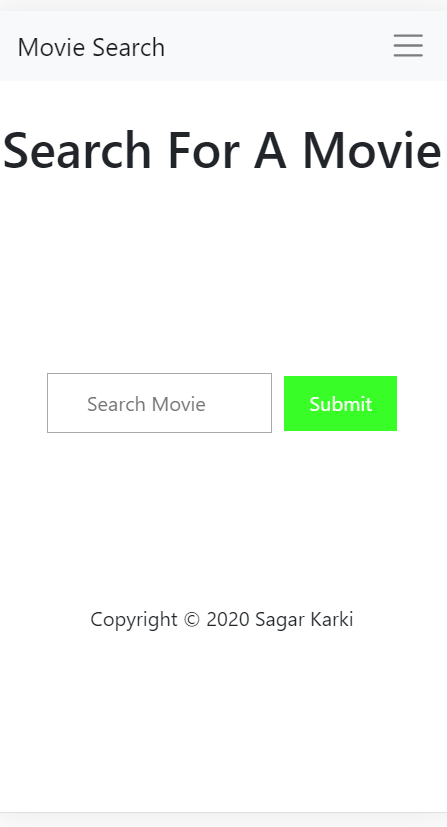
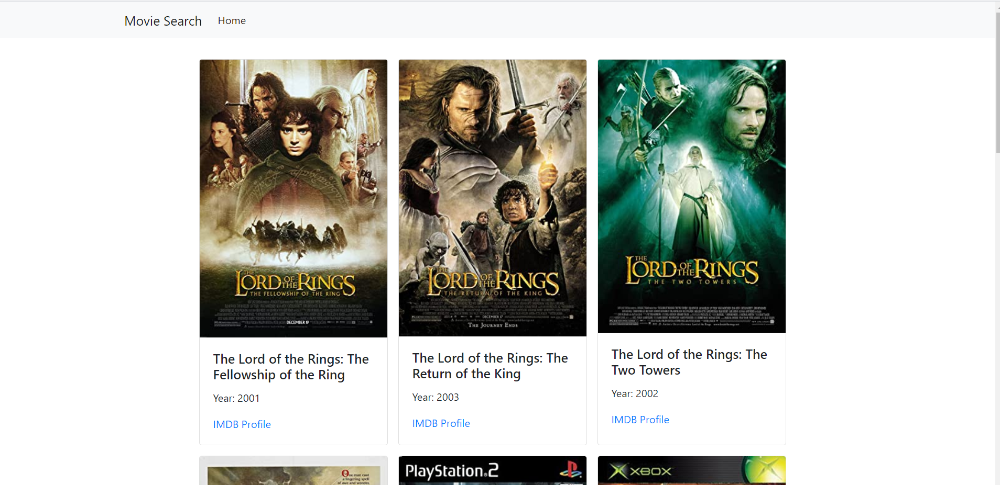
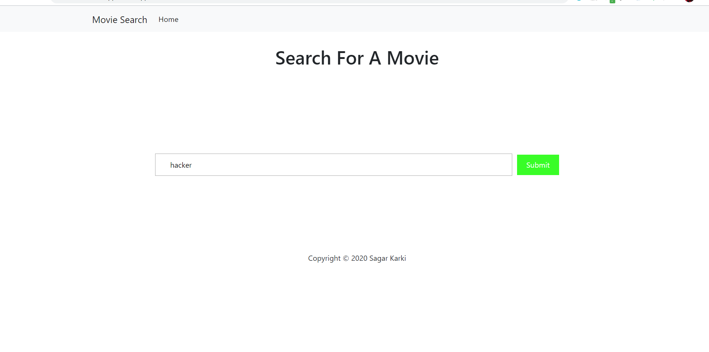

# NodeJs-Movie-Search
# Movie App
> Simple Web app that search and give information of movie.








Windows:
You can download git and NodeJs
git clone https://github.com/sagar608/NodeJs-Movie-Search.git
cd NodeJs-Movie-Search
npm install
npm start
```

## Bult with


* OMDBapi - Api for Movie
* HTML - Markup Language
* CSS & Bootstrap -  UI & Styling
* NodeJs


